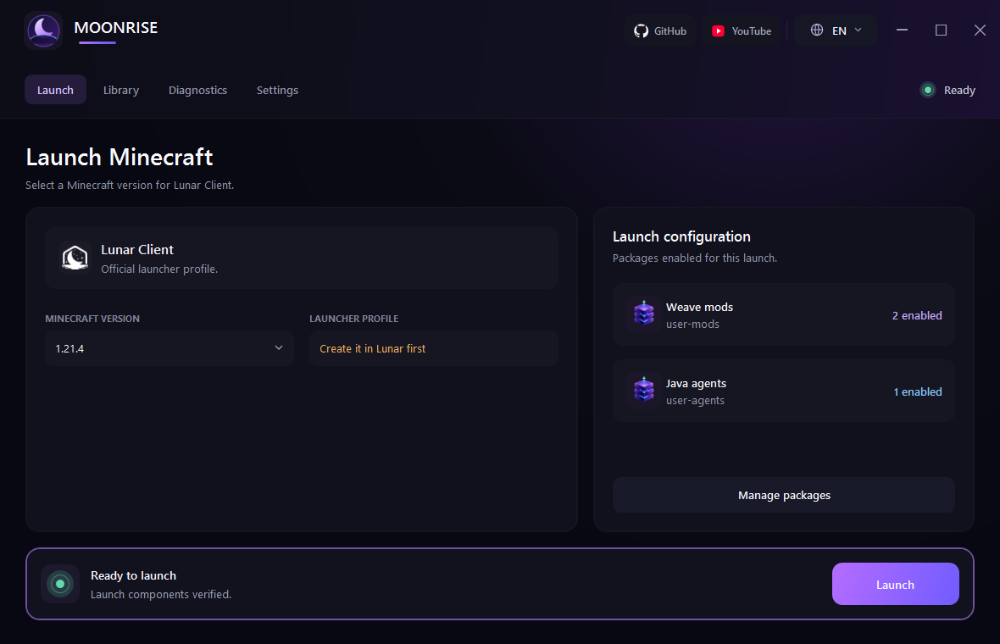
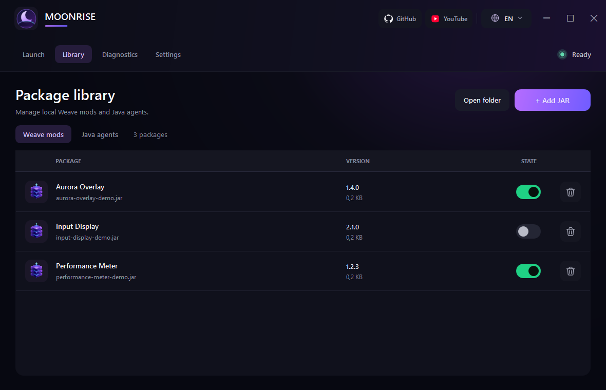
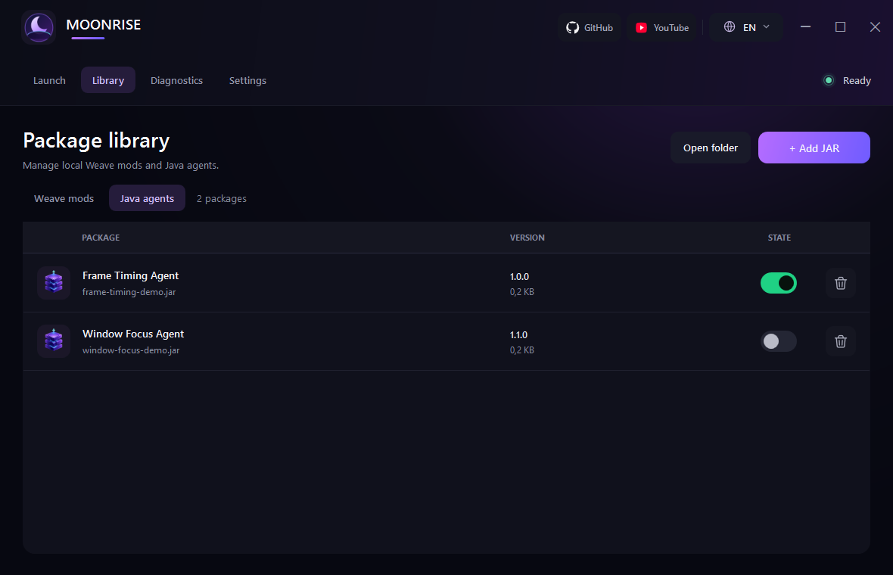
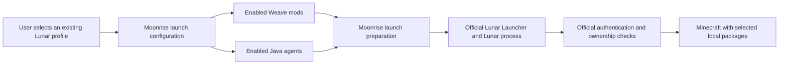
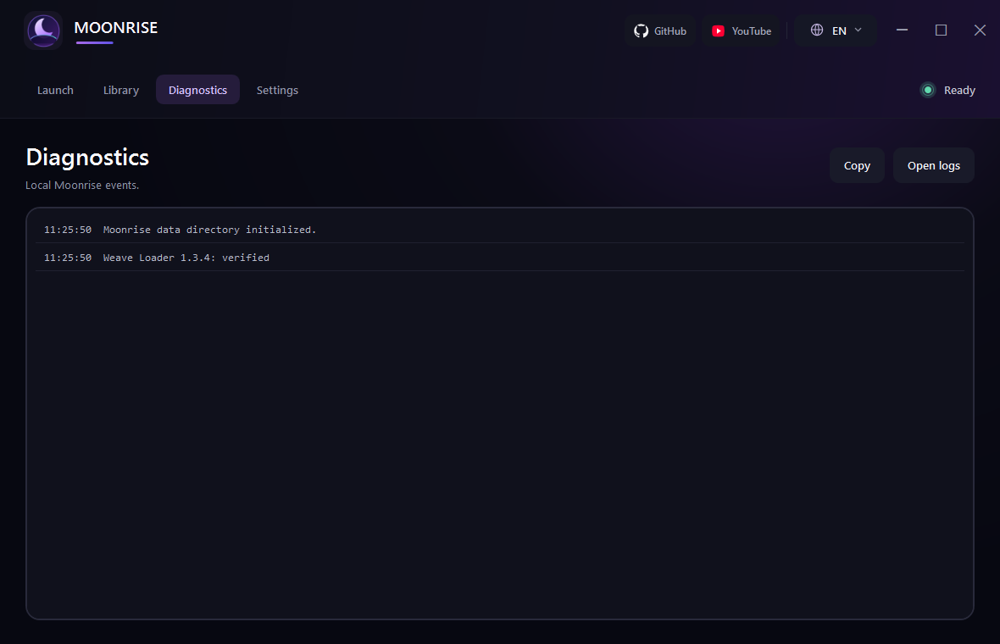

<p align="center">
  
</p>

<h1 align="center">Moonrise</h1>

<p align="center"><strong>A modern mod manager and launcher for Lunar Client.</strong></p>

<p align="center">
  <strong>English</strong> | <a href="README_RU.md">Русский</a>
</p>

<p align="center">
  <a href="https://github.com/ZOONGG/Moonrise/actions/workflows/build.yml"></a>
  <a href="https://github.com/ZOONGG/Moonrise/releases/latest"></a>
  <a href="LICENSE"></a>
  
  
</p>



## What Moonrise is

Moonrise is an open-source Windows application for launching existing official Lunar Client profiles with local Weave mods and Java agents. It organizes packages, prepares an isolated launch configuration, and hands startup to the official Lunar Launcher.

Moonrise is a companion application, not a replacement for the official launcher. It does not implement account authentication, download Lunar Client, or create Minecraft sessions. Users sign in through the official Lunar Launcher, and authentication and ownership checks stay inside official Lunar components.

## Key features

- Detects the official Lunar Launcher and reads existing Lunar profile metadata.
- Selects an exact Minecraft version and checks that its Lunar profile already exists.
- Imports, validates, enables, disables, and removes local Weave mods and Java agents.
- Saves, applies, imports, and exports local launch loadouts without embedding JAR files.
- Can open an optional signed package catalog and verifies its signature, HTTPS source, size, and SHA-256 before import.
- Downloads the official Weave Loader 1.3.4 on demand and verifies its SHA-256 and manifest entry point.
- Checks declared package compatibility before launch and offers a safe-launch mode with third-party packages disabled.
- Shows local diagnostics, redacts common token formats, and creates a local redacted crash analysis after an abnormal game exit.
- Provides equivalent Russian and English controls.

<p align="center">
  
  
</p>

Screenshots contain synthetic package metadata created only for documentation; Moonrise does not ship those packages or any user JARs.

## How Moonrise works



Moonrise reads the official launcher's profile database to find Lunar profiles, updates only the launcher's selected `gameProfile` setting, creates a temporary snapshot of enabled packages, and starts the official launcher. The official launcher remains responsible for account selection, authentication, ownership checks, downloads, and session creation.

## Requirements

- Windows 10 or Windows 11, x64.
- The current official Lunar Launcher installed.
- A Lunar Client profile for the exact Minecraft version, created or launched at least once in the official launcher.
- Trusted Weave mods and/or Java agents compatible with that client build.

Moonrise lists common Minecraft versions from 1.8.9 through 1.21.4 and also discovers versions from the official profile database. A version appearing in the selector is not a compatibility guarantee.

## Installation

1. Open the [latest GitHub Release](https://github.com/ZOONGG/Moonrise/releases/latest).
2. Download `Moonrise-<version>-win-x64.zip` and the matching `.sha256` file.
3. Compare the published checksum:

   ```powershell
   (Get-FileHash .\Moonrise-<version>-win-x64.zip -Algorithm SHA256).Hash
   Get-Content .\Moonrise-<version>-win-x64.zip.sha256
   ```

4. Extract the complete ZIP to a writable folder.
5. Run `Moonrise.exe`.

Published builds are self-contained; users do not need to install .NET. Releases are currently unsigned, so Windows may show a SmartScreen prompt. Verify the release source and checksum before continuing.

## First launch

1. Install the official Lunar Launcher.
2. Sign in through the official Lunar Launcher.
3. Create or launch the required Lunar Client profile/version at least once.
4. Close the official launcher completely when Moonrise asks you to do so.
5. Start Moonrise.
6. Select the existing Lunar profile's exact Minecraft version.
7. Add trusted Weave mods and/or Java agents.
8. Enable the packages required for this launch.
9. Select **Launch**.
10. Complete authentication or ownership checks in official Lunar components if prompted.

Moonrise does not request or manage Microsoft, Minecraft, or Lunar account credentials.

## Adding Weave mods

1. Open **Library → Weave mods**.
2. Select **Add JAR** and choose one or more trusted Weave mod JARs.
3. Review the detected name and version.

Moonrise requires `weave.mod.json` and reads its generic package metadata. Importing a JAR validates its structure; it does not establish that the code is safe or compatible.

## Adding Java agents

1. Open **Library → Java agents**.
2. Select **Add JAR** and choose one or more trusted agent JARs.
3. Review the detected title and version.

A Java-agent JAR must declare `Premain-Class` or `Agent-Class` in `META-INF/MANIFEST.MF`.

> [!WARNING]
> Mods and Java agents are executable code. Only load JAR files from sources you trust.

## Enabling and removing packages

- Use the switch beside a package to include or exclude it from future launches.
- Use the remove button to delete Moonrise's local copy from `user-mods/` or `user-agents/`.
- Use launch loadouts to save the selected version and enabled package filenames. Loadout exports contain configuration metadata, not JAR content.
- Optional signed catalogs are user-selected; Moonrise has no built-in mod list. A valid catalog signature and package hash prove catalog integrity, not that third-party code is harmless or compatible.

Moonrise ships with no mods and no user-provided Java agents.

## Launch configuration

The **Launch** page shows the exact Minecraft version, matching official Lunar profile, active package counts, and current status. Before starting, Moonrise checks declared package version/dependency information. Errors block that launch; warnings are written to diagnostics.

In **Settings**, **Safe launch** starts a diagnostic session without third-party Weave mods or Java agents. **Close after launch** closes Moonrise only after the game process has been detected. These options do not alter official authentication behavior.

## Diagnostics and logs



The **Diagnostics** page shows local Moonrise initialization, package, compatibility, and launch events. Managed logs are stored under `logs/`; abnormal game exits can produce a redacted text report under `crash-reports/` with an exit code, a basic classification, recommendations, and up to 100 recent managed diagnostic lines.

Token redaction reduces risk but cannot guarantee that arbitrary third-party text contains no private information. Before sharing a log or crash report, remove personal paths, usernames, account details, identifiers, private package names, and full command lines. Never upload account files or JARs.

## Security and privacy

> [!IMPORTANT]
> Moonrise does not request or manage Microsoft, Minecraft, or Lunar account credentials. It must not read, copy, store, log, or modify account/session tokens.

Moonrise stores only its own local configuration and runtime data:

```text
moonrise-settings.json  language, Lunar client marker, selected version, launcher path,
                        close/safe-launch preferences, active loadout, disabled filenames
profiles/               local loadout JSON files; no JAR content
user-mods/              user-owned Weave mod JARs
user-agents/            user-owned Java-agent JARs
runtime/weave/           verified Weave Loader download
runtime/sessions/        temporary package snapshots and launch proofs
logs/                    redacted Moonrise-managed logs
crash-reports/           redacted local Moonrise crash analyses
```

To select an existing profile, Moonrise opens `.lunarclient/db/profiles.db` read-only and changes only `settings.gameProfile` in `.lunarclient/settings/launcher.json`. It does not access the official launcher's account or token files.

All user content and runtime state above are excluded from source control and release archives.

## Compatibility limitations

- Lunar Client, the official Lunar Launcher, Weave Loader, or profile formats may change without notice.
- Listing a Minecraft version does not mean that Moonrise, Weave Loader, or a particular package has been verified with it.
- Package metadata and preflight checks cannot prove runtime compatibility or safety.
- Moonrise cannot guarantee that every mod or Java agent works with every Lunar build or with every other package.
- Moonrise does not bypass anti-cheat, authentication, ownership checks, or client restrictions.
- Back up important local configuration before testing new third-party code.

## Building from source

Requirements: Windows 10/11 x64, the .NET 8 SDK, Git, and PowerShell.

```powershell
git clone https://github.com/ZOONGG/Moonrise.git
cd Moonrise
dotnet restore Moonrise.sln --locked-mode
dotnet build Moonrise.sln -c Release --no-restore
dotnet test Moonrise.sln -c Release --no-build
dotnet publish src/Moonrise/Moonrise.csproj -c Release -r win-x64 --self-contained true --no-restore -o release/Moonrise
```

The application publish uses the reviewed `runtime/bridge/Moonrise.Native.dll` already present in the repository. Branding exports can be regenerated with `tools/generate-brand-assets.ps1`.

## Project structure

```text
assets/branding/         Moonrise vector masters and icon exports
docs/images/en/          current English application screenshots
docs/images/ru/          current Russian application screenshots
extensions/              optional, separately built extension source
native/Moonrise.Native/  native process-bridge source and documentation
runtime/bridge/          redistributable native bridge required at runtime
src/Moonrise/            .NET 8 WPF application
tests/Moonrise.Tests/    xUnit service tests
tools/                   deterministic branding and maintenance utilities
```

## Contributing

Read [CONTRIBUTING.md](CONTRIBUTING.md) before opening a pull request. Keep the core mod-agnostic, preserve Russian/English parity, add tests for behavior changes, and never commit user JARs, account data, logs, settings, tokens, private client material, or generated runtime sessions.

## Reporting security issues

Do not disclose vulnerabilities, credentials, or private files in a public issue. Follow the private process in [SECURITY.md](SECURITY.md).

## Roadmap

- Broader automated compatibility coverage for official launcher and profile-format changes.
- More guided privacy review before exporting diagnostic bundles.
- Expanded end-to-end UI and clean-checkout release validation.

Roadmap items are intentions, not release commitments.

## License

Moonrise source code and original Moonrise assets are licensed under the [MIT License](LICENSE). External projects and dependencies retain their own terms; see [THIRD_PARTY_NOTICES.md](THIRD_PARTY_NOTICES.md). The Moonrise MIT License does not grant rights to Lunar Client, Minecraft, Mojang, Microsoft, Weave, third-party mods, Java agents, or user-provided JARs.

## Disclaimer

Moonrise is unofficial and is not affiliated with, sponsored by, or endorsed by Lunar Client, Mojang, Microsoft, or Weave. Minecraft and other names and marks belong to their respective owners. Third-party updates may break compatibility at any time.
