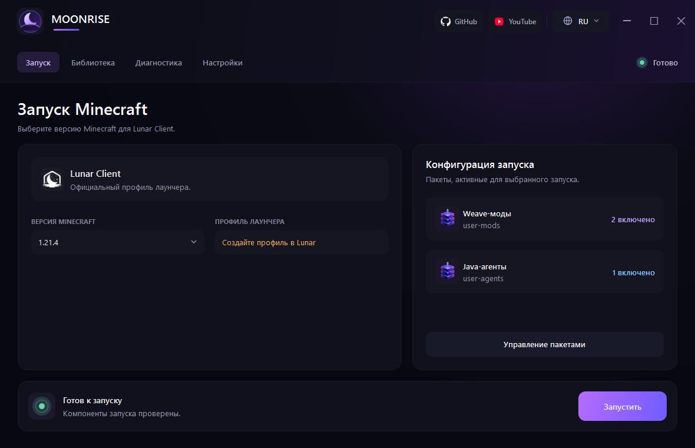
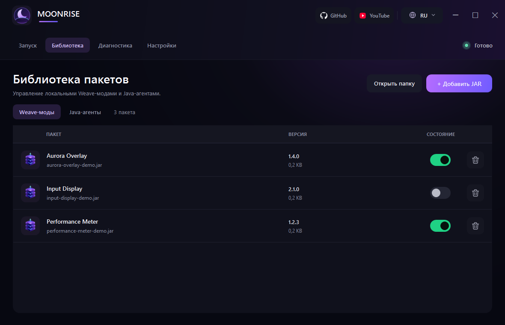
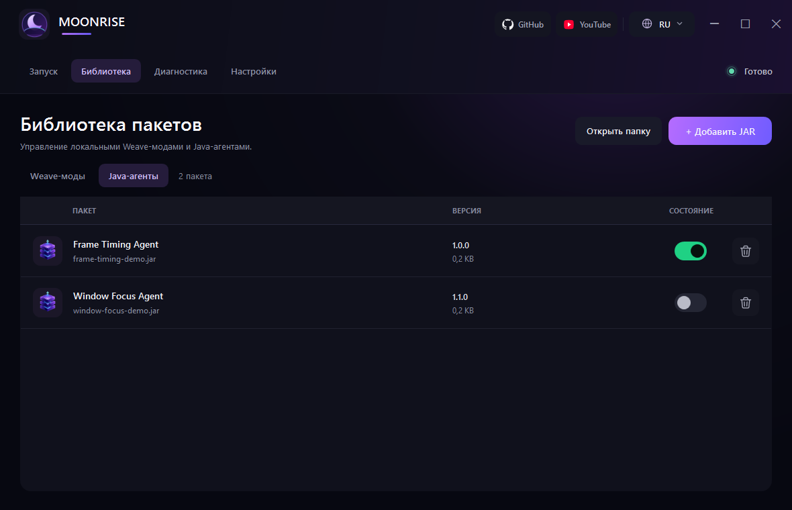
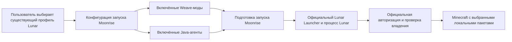
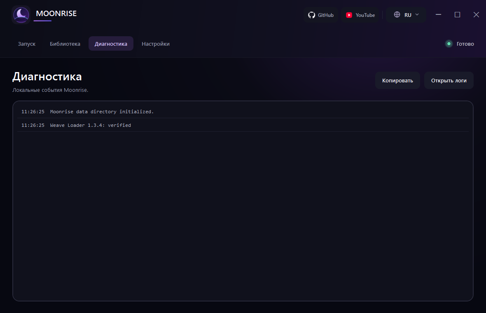

<p align="center">
  
</p>

<h1 align="center">Moonrise</h1>

<p align="center"><strong>Современный менеджер модов и лаунчер для Lunar Client.</strong></p>

<p align="center">
  <a href="README.md">English</a> | <strong>Русский</strong>
</p>

<p align="center">
  <a href="https://github.com/ZOONGG/Moonrise/actions/workflows/build.yml"></a>
  <a href="https://github.com/ZOONGG/Moonrise/releases/latest"></a>
  <a href="LICENSE"></a>
  
  
</p>



## Что такое Moonrise

Moonrise — открытое приложение для Windows, которое запускает существующие официальные профили Lunar Client с локальными Weave-модами и Java-агентами. Оно упорядочивает пакеты, готовит изолированную конфигурацию запуска и передаёт запуск официальному Lunar Launcher.

Moonrise дополняет официальный лаунчер, а не заменяет его. Приложение не реализует авторизацию, не загружает Lunar Client и не создаёт сессии Minecraft. Пользователь входит в аккаунт через официальный Lunar Launcher; авторизация и проверка владения остаются внутри официальных компонентов Lunar.

## Основные возможности

- Обнаружение официального Lunar Launcher и чтение метаданных существующих профилей Lunar.
- Выбор точной версии Minecraft и проверка наличия соответствующего профиля Lunar.
- Импорт, проверка структуры, включение, отключение и удаление локальных Weave-модов и Java-агентов.
- Сохранение, применение, импорт и экспорт локальных наборов запуска без включения JAR-файлов.
- Открытие необязательного подписанного каталога пакетов с проверкой подписи, HTTPS-источника, размера и SHA-256 перед импортом.
- Загрузка официального Weave Loader 1.3.4 по требованию с проверкой SHA-256 и точки входа в манифесте.
- Проверка заявленной совместимости пакетов перед запуском и безопасный режим без сторонних пакетов.
- Локальная диагностика с маскированием распространённых форматов токенов и локальный отчёт после аварийного завершения игры.
- Равнозначный интерфейс на русском и английском языках.

<p align="center">
  
  
</p>

На снимках экрана показаны синтетические метаданные пакетов, созданные только для документации. Moonrise не поставляет эти пакеты или какие-либо пользовательские JAR-файлы.

## Как работает Moonrise



Moonrise читает базу профилей официального лаунчера, меняет только параметр выбранного профиля `gameProfile`, создаёт временный снимок включённых пакетов и запускает официальный лаунчер. Выбор аккаунта, авторизация, проверка владения, загрузки и создание сессии остаются обязанностью официального лаунчера.

## Требования

- Windows 10 или Windows 11, x64.
- Установленный актуальный официальный Lunar Launcher.
- Профиль Lunar Client для точной версии Minecraft, хотя бы один раз созданный или запущенный в официальном лаунчере.
- Доверенные Weave-моды и/или Java-агенты, совместимые с этой сборкой клиента.

Moonrise показывает распространённые версии Minecraft от 1.8.9 до 1.21.4 и дополняет список версиями из официальной базы профилей. Наличие версии в списке не гарантирует совместимость.

## Установка

1. Откройте [последний выпуск на GitHub](https://github.com/ZOONGG/Moonrise/releases/latest).
2. Скачайте `Moonrise-<version>-win-x64.zip` и соответствующий файл `.sha256`.
3. Сравните опубликованную контрольную сумму:

   ```powershell
   (Get-FileHash .\Moonrise-<version>-win-x64.zip -Algorithm SHA256).Hash
   Get-Content .\Moonrise-<version>-win-x64.zip.sha256
   ```

4. Полностью распакуйте ZIP-архив в папку с правом записи.
5. Запустите `Moonrise.exe`.

Опубликованные сборки самодостаточны: устанавливать .NET пользователю не требуется. Сейчас выпуски не подписаны, поэтому Windows может показать предупреждение SmartScreen. Перед запуском проверьте источник выпуска и контрольную сумму.

## Первый запуск

1. Установите официальный Lunar Launcher.
2. Войдите в аккаунт через официальный Lunar Launcher.
3. Хотя бы один раз создайте или запустите нужный профиль/версию Lunar Client.
4. Полностью закройте официальный лаунчер, когда Moonrise попросит это сделать.
5. Запустите Moonrise.
6. Выберите точную версию Minecraft существующего профиля Lunar.
7. Добавьте доверенные Weave-моды и/или Java-агенты.
8. Включите пакеты, необходимые для этого запуска.
9. Нажмите **Запустить**.
10. Если появится запрос, завершите авторизацию или проверку владения в официальных компонентах Lunar.

Moonrise не запрашивает и не управляет учётными данными Microsoft, Minecraft или Lunar.

## Добавление Weave-модов

1. Откройте **Библиотека → Weave-моды**.
2. Нажмите **Добавить JAR** и выберите один или несколько доверенных JAR-файлов Weave-модов.
3. Проверьте обнаруженные название и версию.

Moonrise требует файл `weave.mod.json` и читает из него общие метаданные пакета. Проверка структуры при импорте не означает, что код безопасен или совместим.

## Добавление Java-агентов

1. Откройте **Библиотека → Java-агенты**.
2. Нажмите **Добавить JAR** и выберите один или несколько доверенных JAR-файлов агентов.
3. Проверьте обнаруженные название и версию.

JAR-файл Java-агента должен объявлять `Premain-Class` или `Agent-Class` в `META-INF/MANIFEST.MF`.

> [!WARNING]
> Моды и Java-агенты являются исполняемым кодом. Загружайте JAR-файлы только из источников, которым доверяете.

## Включение и удаление пакетов

- Переключатель рядом с пакетом включает или исключает его из следующих запусков.
- Кнопка удаления удаляет локальную копию Moonrise из `user-mods/` или `user-agents/`.
- Наборы запуска сохраняют выбранную версию и имена включённых пакетов. Экспорт набора содержит только метаданные конфигурации, но не JAR-файлы.
- Подписанные каталоги выбирает сам пользователь; встроенного списка модов в Moonrise нет. Корректная подпись каталога и хеш пакета подтверждают целостность, но не безвредность или совместимость стороннего кода.

Moonrise не поставляется с модами или пользовательскими Java-агентами.

## Конфигурация запуска

На странице **Запуск** показаны точная версия Minecraft, соответствующий официальный профиль Lunar, количество активных пакетов и текущее состояние. Перед запуском Moonrise проверяет заявленные версии и зависимости пакетов. Ошибки блокируют конкретный запуск, а предупреждения записываются в диагностику.

Параметр **Безопасный запуск** в настройках запускает диагностическую сессию без сторонних Weave-модов и Java-агентов. Параметр **Закрывать после запуска** закрывает Moonrise только после обнаружения игрового процесса. Эти параметры не меняют работу официальной авторизации.

## Диагностика и журналы



На странице **Диагностика** отображаются локальные события инициализации, работы с пакетами, проверки совместимости и запуска. Управляемые журналы находятся в `logs/`. После аварийного завершения игры в `crash-reports/` может появиться текстовый отчёт с кодом завершения, базовой классификацией, рекомендациями и последними 100 строками управляемой диагностики.

Маскирование токенов снижает риск, но не гарантирует отсутствие личных данных в произвольном тексте от стороннего ПО. Перед публикацией журнала или отчёта удалите личные пути, имена пользователей, данные аккаунта, идентификаторы, названия приватных пакетов и полные командные строки. Никогда не загружайте файлы аккаунтов или JAR-файлы.

## Безопасность и конфиденциальность

> [!IMPORTANT]
> Moonrise не запрашивает и не управляет учётными данными Microsoft, Minecraft или Lunar. Приложение не должно читать, копировать, сохранять, записывать в журналы или изменять токены аккаунта и сессии.

Moonrise хранит только собственную локальную конфигурацию и рабочие данные:

```text
moonrise-settings.json  язык, признак клиента Lunar, выбранная версия, путь к лаунчеру,
                        параметры закрытия/безопасного запуска, активный набор, отключённые файлы
profiles/               локальные JSON-файлы наборов без содержимого JAR
user-mods/              пользовательские JAR-файлы Weave-модов
user-agents/            пользовательские JAR-файлы Java-агентов
runtime/weave/           проверенная загрузка Weave Loader
runtime/sessions/        временные снимки пакетов и подтверждения запуска
logs/                    журналы Moonrise с маскированием токенов
crash-reports/           локальные отчёты Moonrise с маскированием токенов
```

Для выбора существующего профиля Moonrise открывает `.lunarclient/db/profiles.db` только для чтения и меняет исключительно `settings.gameProfile` в `.lunarclient/settings/launcher.json`. Файлы аккаунтов и токенов официального лаунчера приложение не открывает.

Все перечисленные пользовательские и рабочие данные исключены из Git и архивов выпусков.

## Ограничения совместимости

- Lunar Client, официальный Lunar Launcher, Weave Loader и форматы профилей могут измениться без предупреждения.
- Наличие версии Minecraft в списке не означает, что Moonrise, Weave Loader или конкретный пакет проверены с ней.
- Метаданные и предварительные проверки пакетов не могут доказать совместимость или безопасность во время выполнения.
- Moonrise не гарантирует работу каждого мода или Java-агента с любой сборкой Lunar и с любым другим пакетом.
- Moonrise не обходит античит, авторизацию, проверку владения или ограничения клиента.
- Перед проверкой нового стороннего кода сохраните резервную копию важной локальной конфигурации.

## Сборка из исходного кода

Требования: Windows 10/11 x64, .NET 8 SDK, Git и PowerShell.

```powershell
git clone https://github.com/ZOONGG/Moonrise.git
cd Moonrise
dotnet restore Moonrise.sln --locked-mode
dotnet build Moonrise.sln -c Release --no-restore
dotnet test Moonrise.sln -c Release --no-build
dotnet publish src/Moonrise/Moonrise.csproj -c Release -r win-x64 --self-contained true --no-restore -o release/Moonrise
```

При публикации используется проверенный `runtime/bridge/Moonrise.Native.dll`, уже находящийся в репозитории. Экспортированные элементы оформления можно заново создать скриптом `tools/generate-brand-assets.ps1`.

## Структура проекта

```text
assets/branding/         векторные оригиналы и значки Moonrise
docs/images/en/          актуальные снимки английского интерфейса
docs/images/ru/          актуальные снимки русского интерфейса
extensions/              исходный код необязательных отдельно собираемых расширений
native/Moonrise.Native/  исходный код и документация нативного моста процессов
runtime/bridge/          распространяемый нативный мост, необходимый при запуске
src/Moonrise/            WPF-приложение на .NET 8
tests/Moonrise.Tests/    сервисные тесты xUnit
tools/                   воспроизводимые инструменты оформления и обслуживания
```

## Участие в разработке

Перед созданием pull request прочитайте [CONTRIBUTING.md](CONTRIBUTING.md). Сохраняйте независимость ядра от конкретных модов, поддерживайте равенство русского и английского интерфейса, добавляйте тесты для изменения поведения и никогда не добавляйте в Git пользовательские JAR-файлы, данные аккаунтов, журналы, настройки, токены, приватные материалы клиента или созданные рабочие сессии.

## Сообщение об уязвимостях

Не публикуйте уязвимости, учётные данные или приватные файлы в открытых issues. Следуйте закрытому процессу из [SECURITY.md](SECURITY.md).

## Планы развития

- Более широкое автоматическое покрытие изменений официального лаунчера и форматов профилей.
- Более понятная проверка конфиденциальности перед экспортом диагностических архивов.
- Расширенные сквозные тесты интерфейса и выпусков из чистого checkout.

Это направления развития, а не обязательства по срокам выпуска.

## Лицензия

Исходный код и оригинальные материалы Moonrise распространяются по [лицензии MIT](LICENSE). Внешние проекты и зависимости сохраняют собственные условия; подробности приведены в [THIRD_PARTY_NOTICES.md](THIRD_PARTY_NOTICES.md). Лицензия MIT проекта Moonrise не предоставляет прав на Lunar Client, Minecraft, Mojang, Microsoft, Weave, сторонние моды, Java-агенты или пользовательские JAR-файлы.

## Отказ от ответственности

Moonrise — неофициальный проект, не связанный с Lunar Client, Mojang, Microsoft или Weave и не одобренный ими. Minecraft и другие названия и товарные знаки принадлежат их владельцам. Обновления сторонних компонентов могут нарушить совместимость в любой момент.
